<!-- ========================================================= -->
<!-- SMARTJARWARTOOLS - README FILE -->
<!-- Author: Shoaib Akhter -->
<!-- ========================================================= -->

<div align="center">

# ⚙️ SmartJarwarTools  
### 🧠 A Modern Full-Stack Web Tools Suite — Smart, Fast, and Elegant  


</div>

---

## 🧰 Overview  

**SmartJarwarTools** is a modern full-stack web application providing a suite of smart file utilities — compress, merge, convert, and watermark your files seamlessly.  

It combines a sleek **React + Bootstrap** frontend with a powerful **Django REST Framework** backend for file processing, storage, and API management.  

> 💡 **Goal:** A single, fast, and elegant hub for everyday file operations.

---

## 🌐 Live Demo  

🔗 **Live Website:** _Coming Soon_  
📡 **Backend API:** _Coming Soon_

---

## ⚙️ Tech Stack  

| Layer | Technologies |
|--------|---------------|
| **Frontend** | React, React Router, Bootstrap 5, Framer Motion |
| **Backend** | Django, Django REST Framework |
| **HTTP / API** | Axios, Fetch |
| **Database** | SQLite |
| **File Handling** | Django File Uploads + DRF Serializers |
| **State Management** | React Context API (Theme + App state) |
| **Icons** | React Icons (Font Awesome) |
| **Deployment** | Coming Soon |

---

## 🚦 Project Routes (Frontend)  

| Route | Component | Description |
|-------|------------|-------------|
| `/` | `Home.jsx` | Landing page introducing all tools |
| `/about` | `About.jsx` | About section with project overview |
| `/contact` | `Contact.jsx` | Contact form with WhatsApp widget |
| `/images-to-pdf` | `ImageToPdf.jsx` | Convert images (JPG/PNG) into a single PDF |
| `/docx-to-pdf` | `DocxToPdf.jsx` | Convert Word documents into PDF |
| `/pdf-to-docx` | `PdfToDocx.jsx` | Convert PDFs into editable Word files |
| `/merge-pdf` | `PdfMerger.jsx` | Merge multiple PDF files into one |
| `/compress-file` | `SmartCompressor.jsx` | Compress PDF or image files |
| `/pdf-to-images` | `PdfSplitter.jsx` | Convert or split PDF pages into images |
| `/image-format-converter` | `ImageFormatConverter.jsx` | Convert images between formats (JPG, PNG, WEBP, etc.) |
| `/watermark` | `ImageWatermark.jsx` | Add text/image watermark for branding or protection |

---

## 🧩 Key Features  

### 🎨 Frontend Highlights  
- Fully **theme-adaptive** (Dark / Light mode)  
- Built with **Bootstrap 5** for responsiveness  
- **Framer Motion** animations for smooth transitions  
- Beautiful **gradient backgrounds** and **neon UI effects**  
- Accessible and mobile-friendly design  
- **WhatsApp floating widget** for instant communication  

### 🖥️ Backend Highlights  
- Powered by **Django REST Framework (DRF)**  
- RESTful APIs for all file operations  
- **File upload & streaming** support for large files  
- **DRF Serializers** for structured data handling  
- **CORS-enabled** for React frontend communication  
- Modular app structure for scalability  

---

## 🔗 Example API Endpoints (Backend)  

| Endpoint | Method | Description |
|-----------|--------|-------------|
| `/compress/` | `POST` | Compress file (PDF/Image) |
| `/merge-pdf/` | `POST` | Merge multiple PDF files |
| `/pdf-to-images/` | `POST` | Convert PDF pages into images |
| `/watermark/` | `POST` | Add watermark to image |
| `/convert/docx-to-pdf/` | `POST` | Convert DOCX to PDF |
| `/convert/pdf-to-docx/` | `POST` | Convert PDF to DOCX |
| `/images-to-pdf/` | `POST` | Combine multiple images into a single PDF |

---

## 🖼️ Screenshots  

> 📸 Replace these with actual image paths from your GitHub repo (`/Images/` folder).

| 💡 Light Mode | 🌙 Dark Mode |
|:-------------:|:------------:|
| 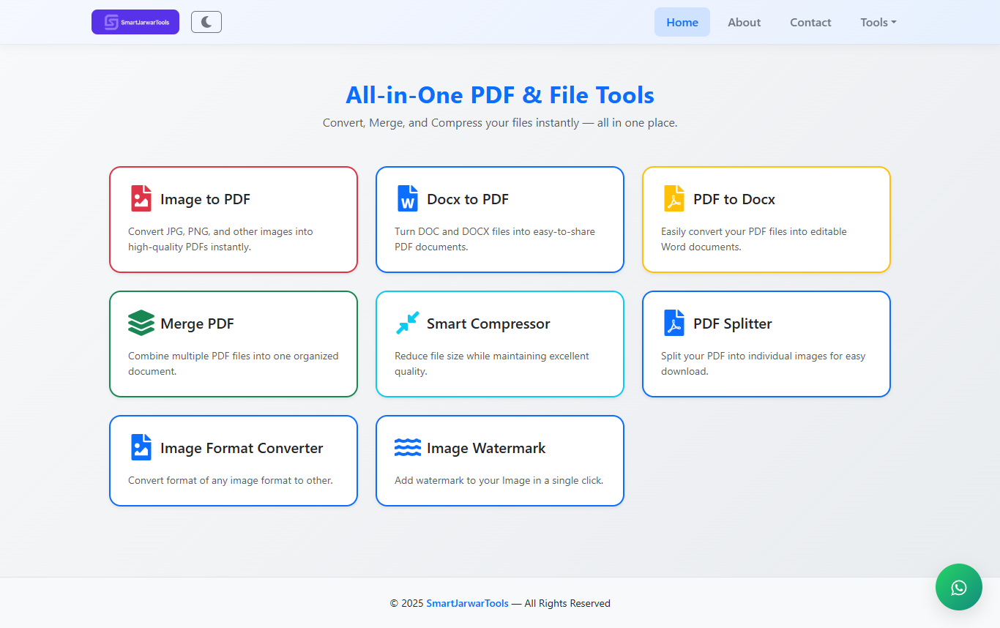 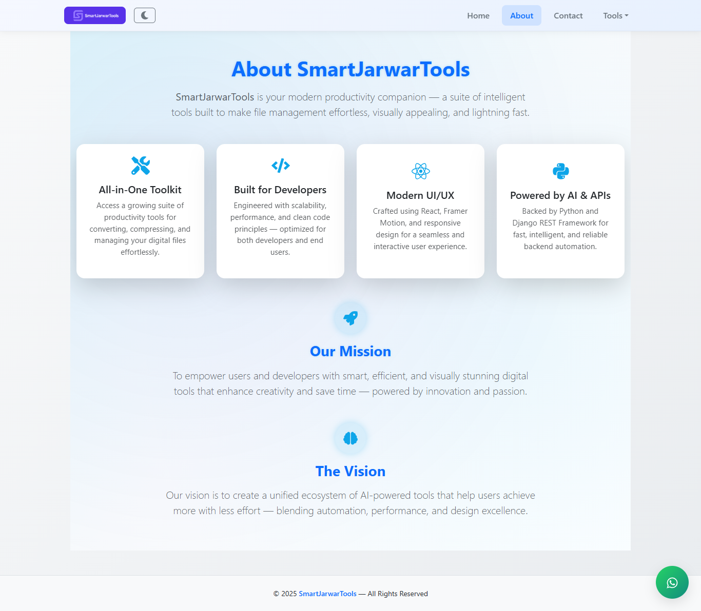  | 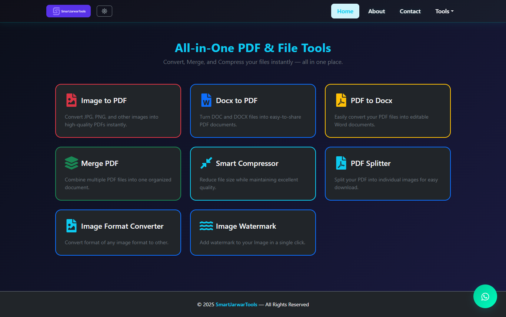 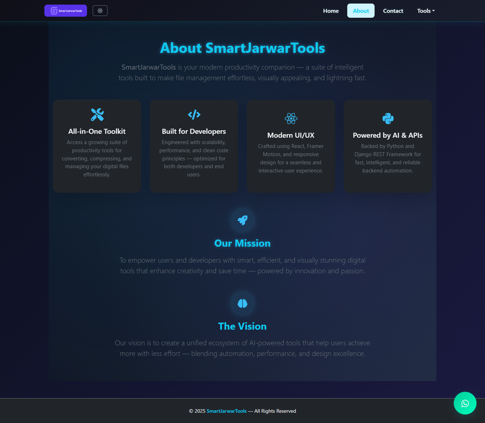 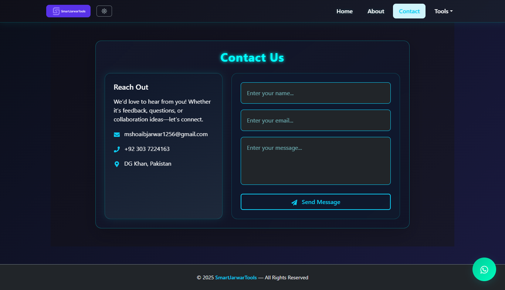 |

| 🧰 Tools Dropdown | 📨 Contact Page |
|:-----------------:|:----------------:|
| 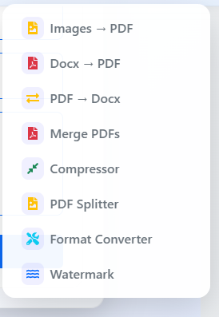 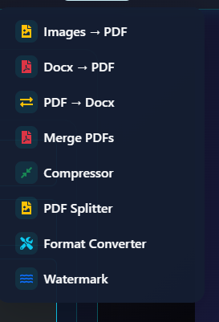 |   |

| ⚙️ PDF Tools | 🖼️ Image Tools |
|:-------------:|:--------------:|
| 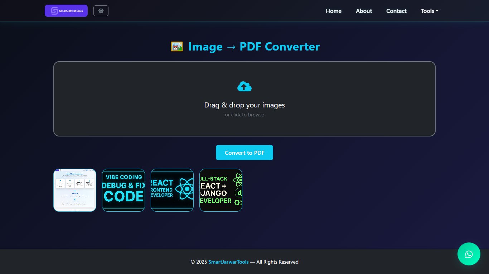 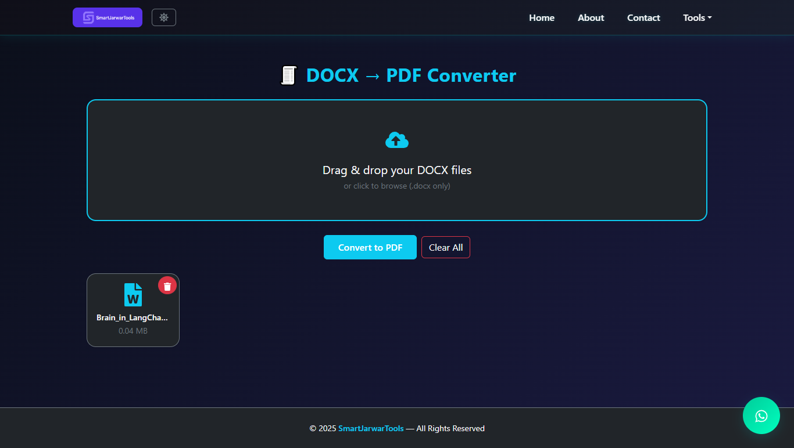 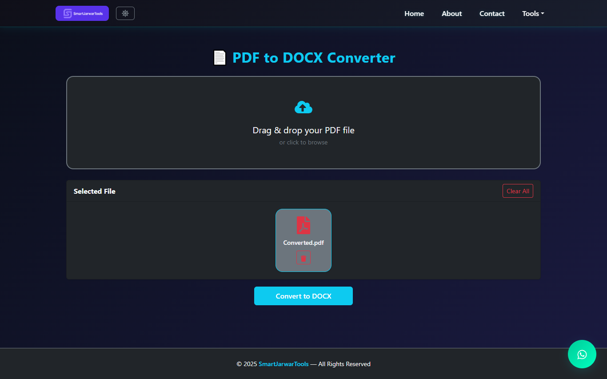 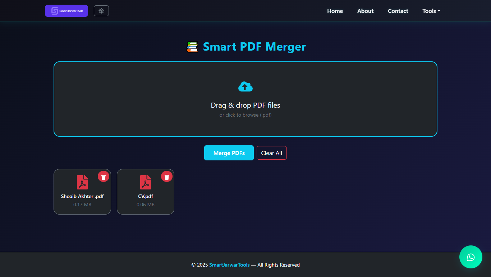 | 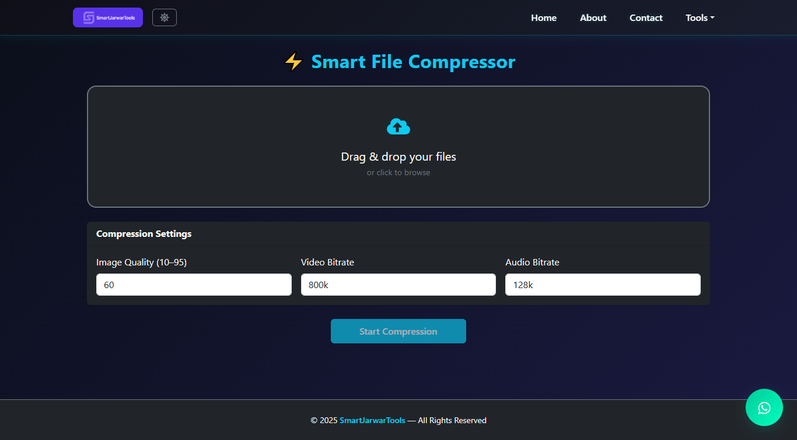 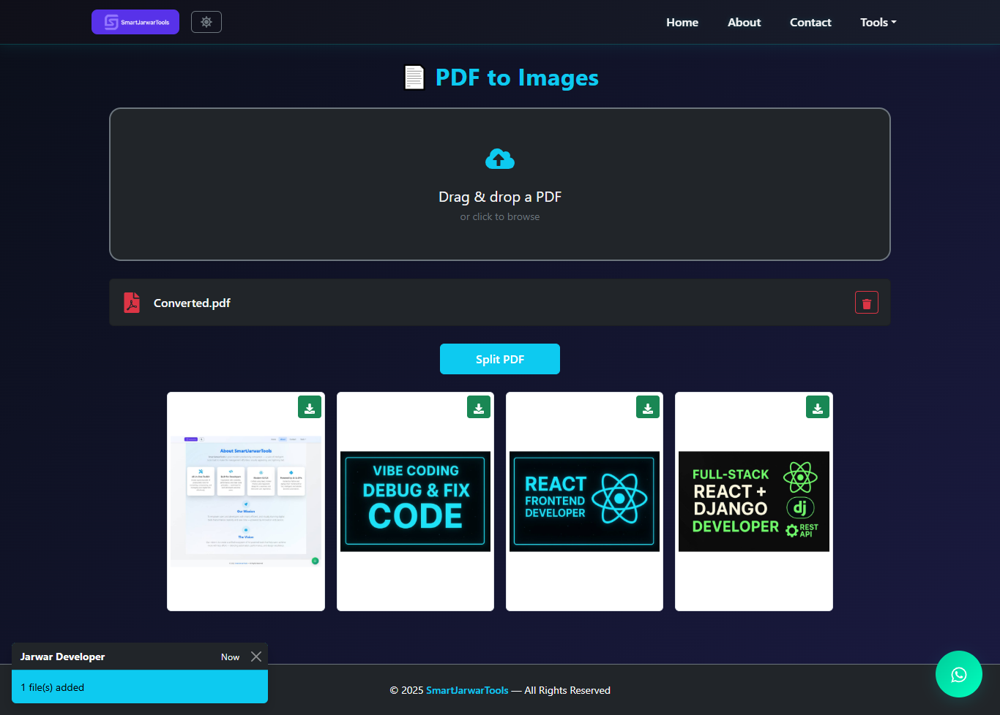 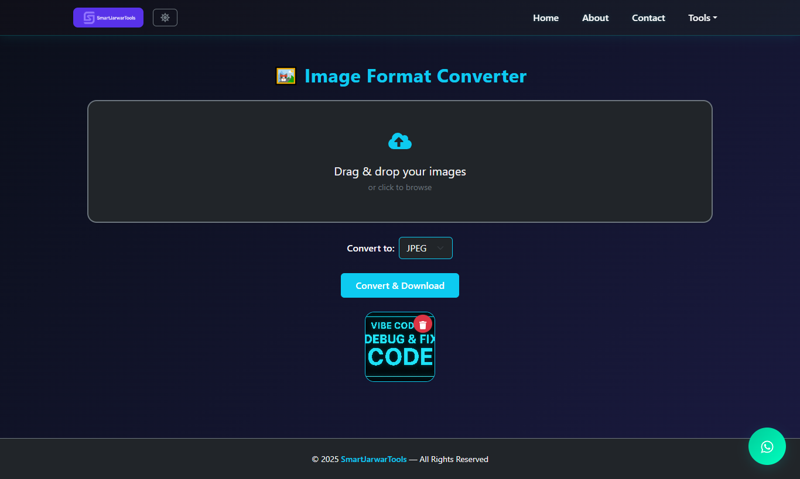 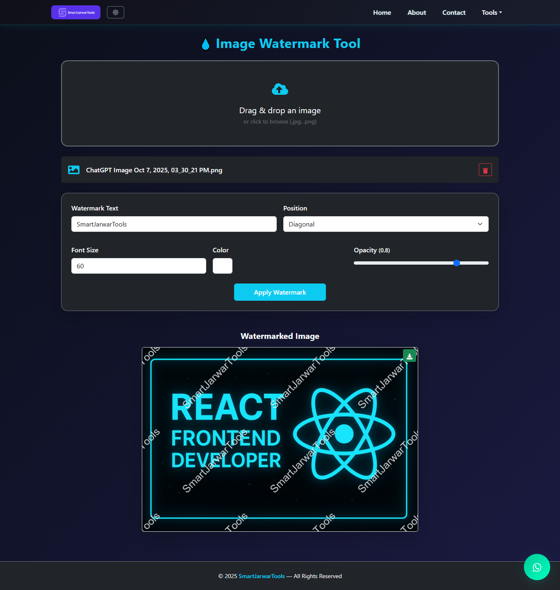 |

---

## 🧑‍💻 Setup Instructions  

### 1️⃣ Backend (Django)
```bash
cd backend
pip install -r requirements.txt
python manage.py migrate
python manage.py runserver
